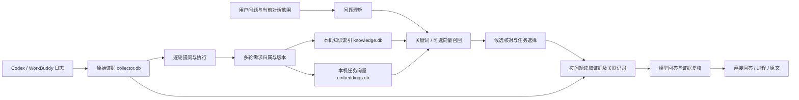

# SessionLens 任务知识问答系统设计 v1

日期：2026-10-06。面向 macOS / Windows 的 Codex、WorkBuddy 会话日志。本文先定义产品与验收契约，再按里程碑开发；实现状态见文末，不把设计项当作已交付能力。

## 1. 用户要得到什么

用户直接提问，理解自己过去的一次工作、继续追问细节，或者比较几次相关工作。例如：

- 当时登录页面为什么改成手机号？谁提出的要求？
- 上海天气怎么查的？curl 请求哪个网址，返回了什么？
- 第一次为什么没成功，第二次改了哪里？
- SSH 动画按哪一版要求生成，有没有实际验证？
- 同一个文件改过几次？哪些任务出现过中断或失败迹象？

回答先解决问题，再展开过程和证据。采集数量、原始 JSON 和长 reasoning 不是首页内容。不得为天气、视频等样本写专用任务答案、固定步骤或固定选中 ID。

## 2. 参考与当前缺口

参考 DeepTutor 的混合检索、结构导航、引用及检索评测，而不是复制学习产品的全部功能：

- [RAG Integration](https://docs.deeptutor.info/ecosystem/rag-integration/)：本地关键词 / 向量检索，以及先浏览结构再读取材料。
- [Knowledge Center](https://github.com/HKUDS/DeepTutor#-knowledge-center--multi-engine-rag-libraries)：可追溯索引版本及带标注证据的检索评测。

现有 SessionLens 已有原始日志、逐轮索引、多轮任务投影、源消息和调用编号关系、问答缓存与回放。主要缺口：检索扫描任务文本、尚无语义向量索引、问题关注点未充分控制证据选取、多任务问题仍按单任务处理。已有多轮关联属于可修正的推断，不能把整个会话、Git 提交或最早父消息当作一次需求。

## 3. 数据与架构



### 3.1 三个知识层次

1. **任务**：原始目标、后续约束、用户对话轮次、来源、时间、已记录状态。摘要必须附来源版本；不能把“做”当作完整目标。
2. **阶段与轮次**：哪轮提出 / 调整 / 执行 / 恢复，绑定那轮的回复、已记录 reasoning、工具动作。第一版采用原始轮次和事件类别，不凭空生成“测试 / 发布”阶段。
3. **证据片段**：事件 ID、所属原始用户轮、种类、工具名称、顺序、有限摘录、截断标记。原始正文、文件位置和哈希继续保存在 `collector.db`。

知识索引是派生数据。删除 / 重建它不得删除采集记录、采集游标、问答、人工关联修正或平台回执。

### 3.2 确定连接与语义归属

- callId / parentId 只在同一来源、会话内核对，重复或缺失身份保留缺口。
- 多轮归属结合用户原话、回复、reasoning 与工具行为；明确切换目标要分开，中断后恢复可以关联旧需求。
- reasoning 只能解释 Agent 当时的理解，不能代表用户批准、工具真实参数或实际执行结果。
- 工具动作固定绑定执行时的需求版本；后来的调整不重写旧执行。
- 模型关联保留理由与证据，人工修正优先；有歧义时不强行合并。

## 4. 本机知识索引

在应用状态目录新增 `knowledge.db`，与采集库分开写入。

- `kb_tasks`：任务 ID、来源、会话、原始标题、时间、状态、轮数、源指纹、索引进度。
- `kb_chunks`：任务 / 原始轮次 / 事件、类别、工具、顺序、摘录、截断、源版本。
- `kb_fts`：SQLite FTS5 BM25。中文以相邻双字词、英文与完整文件名 / 网址组成检索词；用户输入按数据处理，不直接拼接 FTS 表达式。
- `kb_vectors`：可选向量，保存片段版本及 embedding 身份（模型、地址、维度）。改变 embedding 配置不得混用旧向量。

任务元信息与事件摘录分批生成；历史低速处理，新近任务优先。不调用模型自动分析全部历史，也不自动下载 embedding 模型。相同版本重复同步不读取原始大工具正文、不重建已有片段。变化的任务替换自己的派生片段；删除 / 合并的旧根任务清理过期索引，检索结果还必须回到当前任务归属核对。

第一阶段使用本地 BM25 与现有模型语义改写。向量召回作为独立接口，只有实际提供同配置的向量才可标记启用；没有向量时明确降级，不将字符向量、随机向量或词语改写冒称语义 embedding。

## 5. 提问与检索

问题规划结构：

```json
{
  "terms": ["检索短词"],
  "subjects": ["原任务主体 / 文件 / 地点"],
  "taskAction": "create|read|install|download|inspect|modify|null",
  "followup": false,
  "ambiguous": false,
  "scope": "single|multiple",
  "facets": ["overview|requirement|reasoning|tools|results|changes|failures|context"]
}
```

### 5.1 找对任务

1. 原话与语义改写共同召回，保留完整文件名、网址和用户明确的来源 / 时间。
2. BM25 与可选向量候选合并；重新核对原始目标、后续约束、原任务动作。文档中顺带提及某主题，不能压过真实执行该主题的任务。
3. “它 / 第二次 / 为什么重试”等追问在已选范围内理解；明确新主题重新检索。检索失败不继续显示上个任务的答案。
4. 单任务相近候选显示名称、来源、时间让用户选择；多任务比较保持每个任务的独立身份，不能合成同一次执行。
5. 若索引仍在整理，说明当前可检索范围，不把“暂未索引”说成“原日志没有”。

### 5.2 找到回答需要的片段

按关注点优先选取：

| 问题关注点 | 优先证据 | 必须补齐 |
|---|---|---|
| 用户要求 / 为什么修改 | 用户多轮讨论、执行前 Agent 方案 | 当时需求版本，不能由后续要求倒推 |
| 思路 / 为什么选择 | 已记录 reasoning | 对应动作、实际参数与返回 |
| 工具 / 网址 / 参数 | 工具调用 | callId 对应返回及执行轮 |
| 返回 / 成功 / 交付 | 工具返回、最终回复 | 调用原文、验证记录或验证缺口 |
| 重试 / 失败 | 中断、失败迹象、调整 | 前一执行与后一执行，失败迹象不等于已核实故障 |
| 上下文 / 记忆 | 日志实际提供的背景片段 | 不能据会话日志声称捕获完整模型输入 |

证据读取预算化，优先问题相关记录，补齐调用返回与需求依据，保留起始目标。达到预算时显示覆盖范围，必要时进一步读取另一组片段。第一版一次最多 120 条 / 约 9 万字符，不宣称全任务验证。

### 5.3 多任务问题

第一版最多同时解释 3 个检索到的任务，注明当前来源 / 时间 / 已索引范围；证据编号全局唯一且每条保留 taskId。回答必须逐任务归因。超过范围提示缩小条件或继续查找，不将 Top-3 说成全部历史。列表问题先给概括和任务条目；点任务进入已有回放。

## 6. 回答契约与界面

主界面沿用已确认的顶置大输入框，输入和问题历史不会在查询后消失。

- 初始：输入框、可提问示例、知识整理状态。
- 查询中：显示本次问题及“理解问题 → 找任务 → 核对证据 → 回答”，清除旧结果视觉占位。
- 需要选择：最多几个相关任务条目，名称 / 来源 / 日期 / 简短目标。
- 单任务回答：先直接回答和可信程度，再提供按真实记录生成的过程；参数、网址和返回用字段 / 条目表达。
- 多任务回答：先解释共同点 / 差异，再按任务列证据，不能套用单任务的固定步骤条。
- 无结果 / 失败：保留问题，说明索引缺口或服务失败，不展示上次的 SSH / 天气结果。
- 证据：正文默认短摘要；原始 reasoning、JSON、大返回在详情展开。reasoning 回放明确“原 Agent 的历史记录”。

回答区分“用户要求”“Agent 解释”“工具记录”“独立验证”。引用存在不等于引用支持结论；模型复核仍可能误判。提问 / 缓存 / 派生摘要都不执行历史命令。重新关联任务或新增证据后，缓存必须失效或提示更新。

## 7. 部署、性能与数据目的地

本机保存、建库和检索；回答使用用户配置的模型。本机知识库与远程推理是两件事。当前中转模型仍需网络。完全离线需要另行配置本地回答模型和本地 embedding，第一版不自动下载。

原始日志上传 AgentPair 做安全分析，与本机知识问答分开配置。建索引不产生网络请求；真实片段发送遵守已有授权范围。模型密钥不进入知识索引、提示词、截图或 Git。

性能目标是待测指标，不作为未经测试的承诺：

- UI 线程不扫描原始日志、不构建向量、不请求模型。
- 后台每批最多整理 10 个任务 / 每个任务最多 50 个证据摘录，批间至少 0.5 秒；新任务优先。
- 单片段保存最多 2000 字符；单任务执行记录分批索引，不在一次问答中扫描全部历史。
- 知识库进度区分“已采集 / 正在整理 / 可检索”，显示待整理和失败，不以记录数冒充用户任务数。
- 限制候选与模型证据包；知识索引超出大小预算时暂停新增索引并明确提示，原始采集继续，不能静默丢弃历史。
- 用实际 Intel Mac 的整理耗时、检索耗时、库大小及 UI 回归验证；Windows 使用同一标准库逻辑并交由 CI 构建，不声称已在本机测试 Windows 二进制。

## 8. 验收与开发里程碑

检索评测数据包含问题、正确任务、必需证据、禁止串入的任务。同时保留虚构夹具和经授权的真实样本，绝不将预设模型返回称为真实模型精度验收。

必须通过：

1. 上海天气查询 / 上海天气网页开发分开；溧阳不误关联上海。
2. SSH 动画 / SSH 运维任务分开；没有验证记录不宣称时长已验证。
3. 登录讨论 → 修改要求 → 不同措辞的执行 → 工具 → 反馈，多轮目标可追溯。
4. 文档重复分析 / 中断后继续，原始轮次及调用保留，天气任务保持独立。
5. 多次任务比较不混用参数、返回或引用；每个结论能定位任务与原文。
6. 长任务中间的相关调用被选中，并补齐返回；超过预算显示缺口。
7. 缓存失效、原始记录不变、重启增量、坏 FTS 输入、后台整理节流和索引降级。

| 里程碑 | 交付物 | 验收 |
|---|---|---|
| M1 本机任务知识库 | 独立知识索引、增量整理、BM25 召回、状态 | 原始游标不变；新增 / 合并 / 重启正确；无需全任务正文扫描 |
| M2 问题驱动证据 | 关注点规划、相关记录与调用返回补齐 | 中间关键记录可引用；需求版本正确；覆盖缺口明确 |
| M3 多任务问答与检索接口 | 有界多任务证据、可选向量接口、引用展示 | 追问 / 切换不串任务；未配置向量不冒充启用 |
| M4 真实样本评测 | 标注真实问题及证据、指标与性能基线 | 取得对应发送授权后实测，不依赖固定答案 |

### 实现记录

- 文档建立：已完成。
- M1：第一版完成。独立 SQLite FTS5 知识库，默认 256 MiB 大小预算，10 个任务 / 每任务 50 个摘录的后台批次，批间等待 0.5 秒；任务增量、合并清理、已修复摘录更新、重启复用、可检索与证据整理进度。
- M2：第一版完成。问题关注点进入证据选取，完整网址 / 文件名优先，补齐调用返回和前置依据。证据包版本 7；大原始记录不整批加载，使用明确截断的摘录，原文保留。
- M3：完成有界多任务问答、独立引用、比较后的歧义追问选择和进入单任务。后续已接通本地 embedding、设置界面与混合召回，具体模型及检索验收见文末；尚无大规模 ANN。
- M4：完成本机只读样本及完全虚构任务的中转实测；全历史真实语义准确率、持续 CPU / 内存和最终索引体积尚未验收。真实文档四轮的中转发送授权仍待确认，没有发送该真实样本。

验证记录：89 项标准库 / Qt 回归通过，包括增量与合并、坏 FTS 输入、大小预算、向量身份隔离、长任务中间调用及返回、大正文截断、比较引用归属、缓存变化和歧义追问。预设模型返回的单元测试不视作真实模型精度验收。

Intel Mac 单次本机只读测量：源投影包含 5067 个任务；首批整理 253 条摘录耗时 0.5073 秒，派生库约 812 KiB；索引不完整时从需求元信息检索上海天气耗时 0.1941 秒，选中既有天气查询任务。该测量没有网络请求，不代表全量索引性能。

已配置中转上的实测仅发送三个完全虚构的接口任务：正确检索三项，引用编号唯一并保留任务身份；回答及复核总耗时 16.43 秒。复核纠正了将虚构调用说成真实执行的措辞。这证明链路可运行，不证明对真实用户历史的准确率。

### Embedding 启用与检索验收（后续实现）

已接通本地 BGE-small-zh-v1.5 int8 ONNX 推理，模型固定到 Xenova 仓库 revision `75c43b069aac4d136ba6bc1122f995fedcfd2781`，本机 CPU、512 维、CLS pooling、L2 归一化，文件哈希及截断配置参与模型身份。使用 `embeddings.db` 保存任务目标 float32 向量，默认 64 MiB / 10000 个任务预算，独立于已满的关键词库。后台每批两个任务、间隔一秒。UI 线程不加载模型或生成向量。设置提供启用开关与模型目录；运行时不自动下载模型或上传历史。

向量生成只包含原始目标及有限后续要求，尚未向量化全部阶段、reasoning 或工具正文。检索将 BM25 与同模型向量候选融合；英文专名先在有限同任务片段 / 原消息上下文核对，中文短主体允许有限插入修饰词；原消息背景只辅助检索，不当作新指令。语义候选缺少足够任务锚点时要求确认，不能靠相似度直接定案。

本机 5069 个任务目标、9 类目标的 27 道检索题对照，使用相同问题意图规划：BM25 Top-1 33.3%、Hit@5 37.0%、错误自动选择 2；混合检索分别为 59.3%、77.8%、0。18 道改写验证题的混合指标为 44.4% / 72.2%；验证题已反复复测，不能称为独立盲测。当前准确率验收未通过。题集及逐题失分保存于本机私有验证目录，真实数据不提交 Git；公开说明只记录方法和汇总。

真实目标的 embedding 与检索全在本机。中转只接收人工编写的问题以做意图理解，未接收源日志、正确任务标签、代码、参数、返回、路径或密码。这不是完全离线的智能助手，也不是最终回答准确率评测。构建任务向量首次约 244 秒，库约 21.45 MiB。
